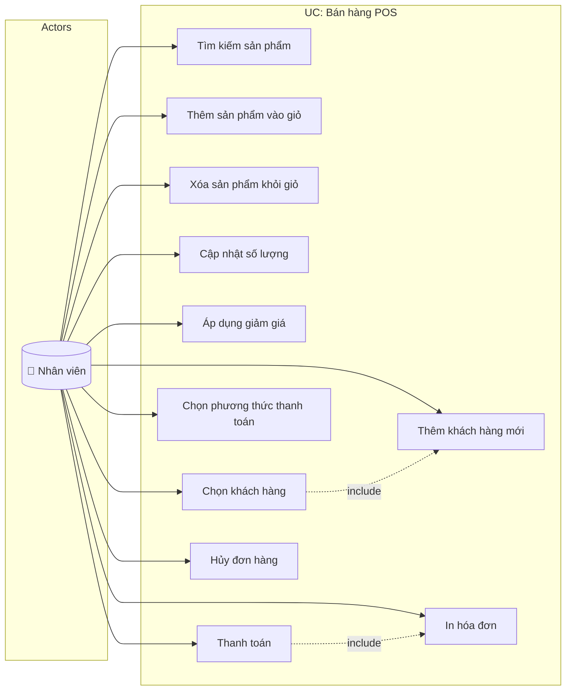
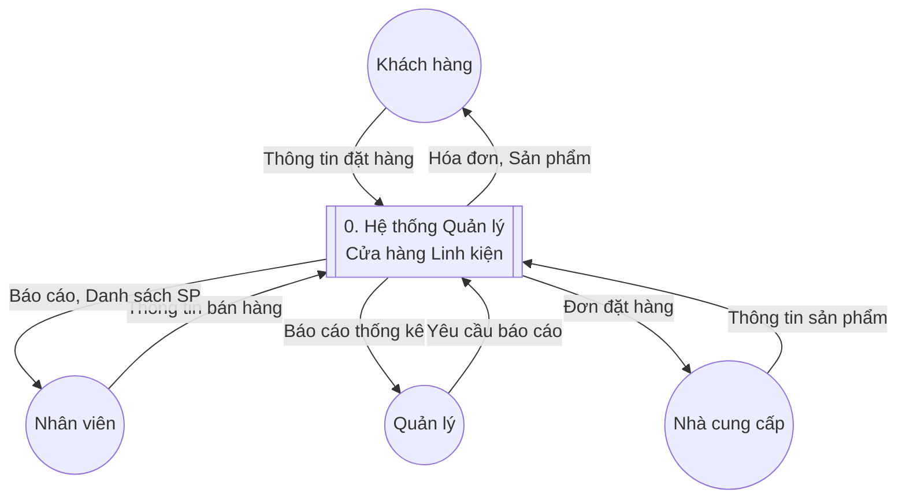
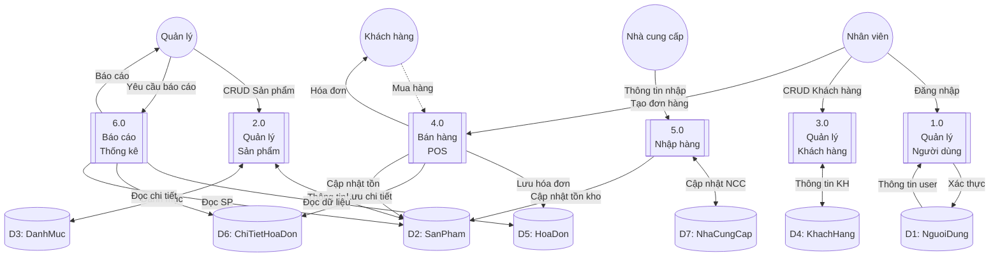
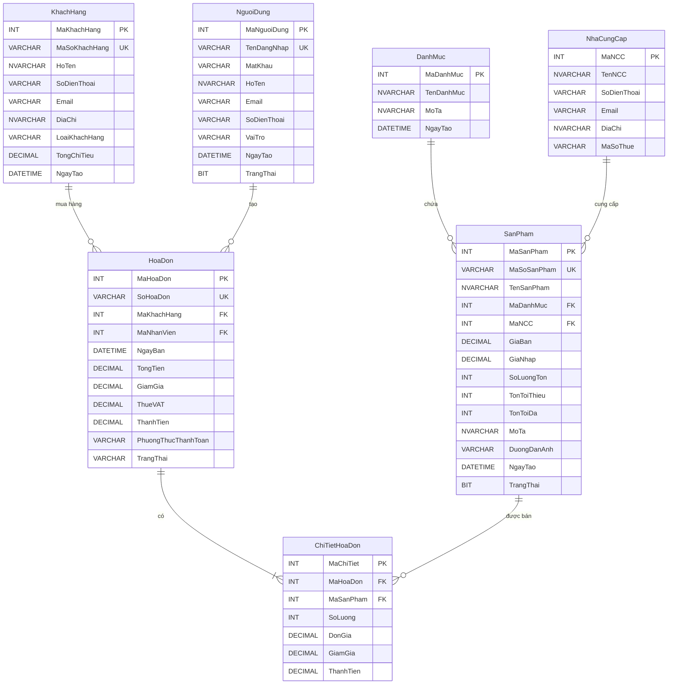
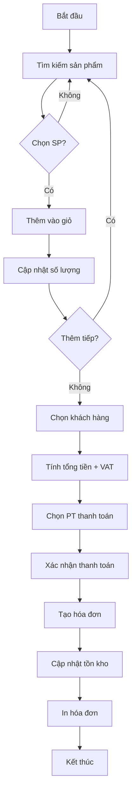

# BÁO CÁO ĐỒ ÁN TỐT NGHIỆP

<div align="center">

## BỘ GIÁO DỤC VÀ ĐÀO TẠO
## TRƯỜNG ĐẠI HỌC ...

---

# ĐỒ ÁN TỐT NGHIỆP

## ĐỀ TÀI:
# XÂY DỰNG PHẦN MỀM QUẢN LÝ CỬA HÀNG LINH KIỆN ĐIỆN TỬ

---

**Giảng viên hướng dẫn:** ...

**Sinh viên thực hiện:**
- Nguyễn Văn Hân
- Nguyễn Văn Khánh  
- Nguyễn Văn Toàn
- Nguyễn Văn Dững
- Nguyễn Văn Tính

**Lớp:** ...

**Khóa:** ...

---

**TP. Hồ Chí Minh, tháng 01 năm 2026**

</div>

---

## MỤC LỤC

- [LỜI CẢM ƠN](#lời-cảm-ơn)
- [LỜI MỞ ĐẦU](#lời-mở-đầu)
- [DANH MỤC HÌNH ẢNH](#danh-mục-hình-ảnh)
- [DANH MỤC BẢNG BIỂU](#danh-mục-bảng-biểu)
- [DANH MỤC TỪ VIẾT TẮT](#danh-mục-từ-viết-tắt)
- [CHƯƠNG 1: TỔNG QUAN VỀ ĐỀ TÀI](#chương-1-tổng-quan-về-đề-tài)
  - [1.1. Đặt vấn đề](#11-đặt-vấn-đề)
  - [1.2. Mục tiêu đề tài](#12-mục-tiêu-đề-tài)
  - [1.3. Phạm vi đề tài](#13-phạm-vi-đề-tài)
  - [1.4. Phương pháp nghiên cứu](#14-phương-pháp-nghiên-cứu)
  - [1.5. Ý nghĩa thực tiễn](#15-ý-nghĩa-thực-tiễn)
- [CHƯƠNG 2: CƠ SỞ LÝ THUYẾT](#chương-2-cơ-sở-lý-thuyết)
  - [2.1. Tổng quan về ngôn ngữ C#](#21-tổng-quan-về-ngôn-ngữ-c)
  - [2.2. .NET Framework](#22-net-framework)
  - [2.3. Windows Forms](#23-windows-forms)
  - [2.4. SQL Server](#24-sql-server)
  - [2.5. ADO.NET](#25-adonet)
- [CHƯƠNG 3: PHÂN TÍCH VÀ THIẾT KẾ HỆ THỐNG](#chương-3-phân-tích-và-thiết-kế-hệ-thống)
  - [3.1. Khảo sát hiện trạng](#31-khảo-sát-hiện-trạng)
  - [3.2. Phân tích yêu cầu](#32-phân-tích-yêu-cầu)
  - [3.3. Sơ đồ Use Case](#33-sơ-đồ-use-case)
  - [3.4. Sơ đồ DFD](#34-sơ-đồ-dfd)
  - [3.5. Sơ đồ ERD](#35-sơ-đồ-erd)
- [CHƯƠNG 4: THIẾT KẾ CƠ SỞ DỮ LIỆU](#chương-4-thiết-kế-cơ-sở-dữ-liệu)
  - [4.1. Mô hình quan hệ](#41-mô-hình-quan-hệ)
  - [4.2. Chi tiết các bảng](#42-chi-tiết-các-bảng)
  - [4.3. Ràng buộc toàn vẹn](#43-ràng-buộc-toàn-vẹn)
- [CHƯƠNG 5: THIẾT KẾ GIAO DIỆN VÀ CHỨC NĂNG](#chương-5-thiết-kế-giao-diện-và-chức-năng)
  - [5.1. Kiến trúc hệ thống](#51-kiến-trúc-hệ-thống)
  - [5.2. Thiết kế giao diện](#52-thiết-kế-giao-diện)
  - [5.3. Mô tả chức năng](#53-mô-tả-chức-năng)
- [CHƯƠNG 6: CÀI ĐẶT VÀ THỬ NGHIỆM](#chương-6-cài-đặt-và-thử-nghiệm)
  - [6.1. Môi trường phát triển](#61-môi-trường-phát-triển)
  - [6.2. Hướng dẫn cài đặt](#62-hướng-dẫn-cài-đặt)
  - [6.3. Kết quả thử nghiệm](#63-kết-quả-thử-nghiệm)
- [CHƯƠNG 7: KẾT LUẬN VÀ HƯỚNG PHÁT TRIỂN](#chương-7-kết-luận-và-hướng-phát-triển)
  - [7.1. Kết quả đạt được](#71-kết-quả-đạt-được)
  - [7.2. Hạn chế](#72-hạn-chế)
  - [7.3. Hướng phát triển](#73-hướng-phát-triển)
- [TÀI LIỆU THAM KHẢO](#tài-liệu-tham-khảo)
- [PHỤ LỤC](#phụ-lục)

---

## LỜI CẢM ƠN

Trong quá trình thực hiện đồ án tốt nghiệp, chúng em đã nhận được sự hướng dẫn, giúp đỡ tận tình từ quý thầy cô và các bạn.

Trước hết, chúng em xin gửi lời cảm ơn chân thành đến **[Tên giảng viên hướng dẫn]** đã tận tình hướng dẫn, chỉ bảo và định hướng cho chúng em trong suốt quá trình thực hiện đồ án.

Chúng em xin cảm ơn quý thầy cô trong Khoa Công nghệ Thông tin đã truyền đạt những kiến thức quý báu trong suốt thời gian học tập tại trường.

Chúng em cũng xin cảm ơn gia đình, bạn bè đã luôn động viên, hỗ trợ trong quá trình học tập và thực hiện đồ án.

Mặc dù đã cố gắng hoàn thành đồ án trong phạm vi và khả năng cho phép, nhưng chắc chắn không tránh khỏi những thiếu sót. Chúng em rất mong nhận được sự góp ý, chỉ bảo từ quý thầy cô để đồ án được hoàn thiện hơn.

Chúng em xin chân thành cảm ơn!

---

## LỜI MỞ ĐẦU

Trong thời đại công nghệ số phát triển mạnh mẽ, việc ứng dụng công nghệ thông tin vào quản lý kinh doanh đã trở thành xu hướng tất yếu. Đặc biệt đối với các cửa hàng bán lẻ linh kiện điện tử, việc quản lý hàng nghìn mặt hàng với đa dạng chủng loại, theo dõi tồn kho, quản lý khách hàng và thống kê doanh thu là những công việc phức tạp, đòi hỏi sự chính xác cao.

Trước thực trạng nhiều cửa hàng linh kiện điện tử vẫn còn sử dụng phương thức quản lý thủ công hoặc các phần mềm chưa phù hợp, nhóm chúng em đã quyết định thực hiện đề tài **"Xây dựng phần mềm Quản lý Cửa hàng Linh kiện Điện tử"**.

Phần mềm được xây dựng nhằm mục đích:
- Tin học hóa quy trình bán hàng, quản lý kho
- Hỗ trợ quản lý thông tin sản phẩm, khách hàng, nhà cung cấp
- Cung cấp các báo cáo thống kê hỗ trợ ra quyết định kinh doanh
- Nâng cao hiệu quả hoạt động và giảm thiểu sai sót

Đồ án được thực hiện với ngôn ngữ lập trình C# trên nền tảng .NET Framework, sử dụng Windows Forms cho giao diện và SQL Server làm hệ quản trị cơ sở dữ liệu.

---

## DANH MỤC HÌNH ẢNH

| STT | Tên hình | Trang |
|-----|----------|-------|
| 1 | Hình 3.1: Sơ đồ Use Case tổng quan | ... |
| 2 | Hình 3.2: Sơ đồ Use Case Quản lý sản phẩm | ... |
| 3 | Hình 3.3: Sơ đồ Use Case Bán hàng POS | ... |
| 4 | Hình 3.4: Sơ đồ DFD Level 0 | ... |
| 5 | Hình 3.5: Sơ đồ DFD Level 1 | ... |
| 6 | Hình 3.6: Sơ đồ ERD | ... |
| 7 | Hình 4.1: Mô hình quan hệ cơ sở dữ liệu | ... |
| 8 | Hình 5.1: Giao diện đăng nhập | ... |
| 9 | Hình 5.2: Giao diện Dashboard | ... |
| 10 | Hình 5.3: Giao diện bán hàng POS | ... |
| 11 | Hình 5.4: Giao diện quản lý sản phẩm | ... |

---

## DANH MỤC BẢNG BIỂU

| STT | Tên bảng | Trang |
|-----|----------|-------|
| 1 | Bảng 3.1: Danh sách các chức năng hệ thống | ... |
| 2 | Bảng 3.2: Phân quyền người dùng | ... |
| 3 | Bảng 4.1: Cấu trúc bảng DanhMuc | ... |
| 4 | Bảng 4.2: Cấu trúc bảng SanPham | ... |
| 5 | Bảng 4.3: Cấu trúc bảng KhachHang | ... |
| 6 | Bảng 4.4: Cấu trúc bảng HoaDon | ... |
| 7 | Bảng 4.5: Cấu trúc bảng ChiTietHoaDon | ... |
| 8 | Bảng 4.6: Cấu trúc bảng NguoiDung | ... |
| 9 | Bảng 4.7: Cấu trúc bảng NhaCungCap | ... |

---

## DANH MỤC TỪ VIẾT TẮT

| STT | Từ viết tắt | Ý nghĩa |
|-----|-------------|---------|
| 1 | CSDL | Cơ sở dữ liệu |
| 2 | HTTT | Hệ thống thông tin |
| 3 | POS | Point of Sale (Điểm bán hàng) |
| 4 | DFD | Data Flow Diagram (Sơ đồ luồng dữ liệu) |
| 5 | ERD | Entity Relationship Diagram (Sơ đồ thực thể quan hệ) |
| 6 | SQL | Structured Query Language |
| 7 | ADO.NET | ActiveX Data Objects for .NET |
| 8 | UI | User Interface (Giao diện người dùng) |
| 9 | CRUD | Create, Read, Update, Delete |
| 10 | NCC | Nhà cung cấp |
| 11 | KH | Khách hàng |
| 12 | SP | Sản phẩm |
| 13 | HD | Hóa đơn |
| 14 | VAT | Value Added Tax (Thuế giá trị gia tăng) |

---

## CHƯƠNG 1: TỔNG QUAN VỀ ĐỀ TÀI

### 1.1. Đặt vấn đề

#### 1.1.1. Bối cảnh thực tiễn

Thị trường linh kiện điện tử tại Việt Nam đang phát triển mạnh mẽ với sự gia tăng nhu cầu về máy tính, thiết bị điện tử. Các cửa hàng linh kiện điện tử phải đối mặt với nhiều thách thức trong quản lý:

- **Số lượng mặt hàng lớn**: Hàng nghìn loại linh kiện với mã sản phẩm, thông số kỹ thuật khác nhau
- **Biến động giá cả**: Giá linh kiện thay đổi thường xuyên theo thị trường
- **Quản lý tồn kho**: Cần theo dõi chính xác số lượng tồn để đặt hàng kịp thời
- **Thông tin khách hàng**: Quản lý khách hàng VIP, khách sỉ, chính sách giảm giá
- **Báo cáo kinh doanh**: Thống kê doanh thu, sản phẩm bán chạy

#### 1.1.2. Hiện trạng

Qua khảo sát thực tế, nhiều cửa hàng linh kiện vẫn gặp các vấn đề:

| Vấn đề | Hậu quả |
|--------|---------|
| Quản lý thủ công bằng sổ sách | Tốn thời gian, dễ sai sót |
| Không có hệ thống quản lý tồn kho | Hết hàng không biết, tồn kho quá nhiều |
| Không theo dõi được khách hàng | Mất khách hàng tiềm năng |
| Không có báo cáo thống kê | Khó đưa ra quyết định kinh doanh |

#### 1.1.3. Lý do chọn đề tài

Từ những vấn đề trên, nhóm chúng em quyết định xây dựng phần mềm **"Quản lý Cửa hàng Linh kiện Điện tử"** với các lý do:

1. **Tính thực tiễn cao**: Đáp ứng nhu cầu thực tế của các cửa hàng
2. **Phù hợp kiến thức**: Áp dụng kiến thức C#, SQL Server đã học
3. **Khả năng mở rộng**: Có thể phát triển thêm nhiều tính năng
4. **Tính khả thi**: Thời gian và nguồn lực phù hợp

### 1.2. Mục tiêu đề tài

#### 1.2.1. Mục tiêu tổng quát

Xây dựng phần mềm quản lý cửa hàng linh kiện điện tử hoàn chỉnh, hỗ trợ các nghiệp vụ bán hàng, quản lý kho, quản lý khách hàng và báo cáo thống kê.

#### 1.2.2. Mục tiêu cụ thể

| STT | Mục tiêu | Mô tả |
|-----|----------|-------|
| 1 | Quản lý sản phẩm | CRUD sản phẩm, danh mục, nhà cung cấp |
| 2 | Bán hàng POS | Giao diện bán hàng nhanh, thanh toán |
| 3 | Quản lý tồn kho | Theo dõi số lượng, cảnh báo hết hàng |
| 4 | Quản lý khách hàng | CRUD khách hàng, phân loại, lịch sử mua |
| 5 | Quản lý nhân viên | Phân quyền, theo dõi hoạt động |
| 6 | Báo cáo thống kê | Doanh thu, sản phẩm bán chạy, khách hàng VIP |
| 7 | In hóa đơn | Xuất hóa đơn cho khách hàng |

### 1.3. Phạm vi đề tài

#### 1.3.1. Phạm vi nghiên cứu

- **Đối tượng**: Cửa hàng bán lẻ linh kiện điện tử quy mô nhỏ và vừa
- **Nghiệp vụ**: Bán hàng, quản lý kho, quản lý khách hàng, báo cáo
- **Công nghệ**: C# .NET Framework, Windows Forms, SQL Server

#### 1.3.2. Giới hạn đề tài

**Bao gồm:**
- Quản lý sản phẩm, danh mục, nhà cung cấp
- Bán hàng (POS)
- Quản lý khách hàng
- Quản lý người dùng và phân quyền
- Nhập hàng
- Báo cáo thống kê
- In hóa đơn

**Không bao gồm:**
- Bán hàng online, thương mại điện tử
- Quản lý công nợ chi tiết
- Kết nối thiết bị ngoại vi (máy quét barcode, máy in bill)
- Ứng dụng di động

### 1.4. Phương pháp nghiên cứu

#### 1.4.1. Phương pháp khảo sát

- Khảo sát thực tế tại các cửa hàng linh kiện
- Thu thập yêu cầu từ người dùng
- Phân tích quy trình nghiệp vụ

#### 1.4.2. Phương pháp phân tích thiết kế

- Phân tích hướng đối tượng
- Thiết kế cơ sở dữ liệu quan hệ
- Sử dụng UML (Use Case, Sequence Diagram)
- Sử dụng DFD (Data Flow Diagram)

#### 1.4.3. Phương pháp phát triển

- Mô hình phát triển thác nước (Waterfall)
- Phân chia công việc theo module
- Kiểm thử từng chức năng

### 1.5. Ý nghĩa thực tiễn

#### 1.5.1. Đối với cửa hàng

- Nâng cao hiệu quả quản lý
- Giảm thiểu sai sót trong bán hàng
- Theo dõi tồn kho chính xác
- Hỗ trợ ra quyết định kinh doanh

#### 1.5.2. Đối với nhân viên

- Thao tác bán hàng nhanh chóng
- Tra cứu thông tin dễ dàng
- Giảm công việc thủ công

#### 1.5.3. Đối với sinh viên

- Áp dụng kiến thức đã học
- Rèn luyện kỹ năng lập trình
- Làm quen với quy trình phát triển phần mềm
- Học cách làm việc nhóm

---

## CHƯƠNG 2: CƠ SỞ LÝ THUYẾT

### 2.1. Tổng quan về ngôn ngữ C#

#### 2.1.1. Giới thiệu C#

C# (đọc là "C sharp") là ngôn ngữ lập trình hướng đối tượng được phát triển bởi Microsoft, là một phần của .NET Framework. C# được thiết kế để:

- Đơn giản, hiện đại, đa năng
- Hỗ trợ lập trình hướng đối tượng hoàn toàn
- Type-safe (an toàn về kiểu dữ liệu)
- Tự động quản lý bộ nhớ (Garbage Collection)

#### 2.1.2. Đặc điểm chính

| Đặc điểm | Mô tả |
|----------|-------|
| Hướng đối tượng | Hỗ trợ đầy đủ OOP: kế thừa, đa hình, đóng gói |
| Type-safe | Kiểm tra kiểu dữ liệu tại thời điểm biên dịch |
| Quản lý bộ nhớ | Garbage Collector tự động thu hồi bộ nhớ |
| Exception Handling | Xử lý ngoại lệ với try-catch-finally |
| Delegates & Events | Hỗ trợ lập trình sự kiện |

#### 2.1.3. Cú pháp cơ bản

```csharp
// Khai báo class
public class SanPham
{
    // Properties
    public int MaSanPham { get; set; }
    public string TenSanPham { get; set; }
    public decimal GiaBan { get; set; }
    
    // Constructor
    public SanPham(int ma, string ten, decimal gia)
    {
        MaSanPham = ma;
        TenSanPham = ten;
        GiaBan = gia;
    }
    
    // Method
    public string HienThiThongTin()
    {
        return $"Mã: {MaSanPham}, Tên: {TenSanPham}, Giá: {GiaBan:N0}";
    }
}
```

### 2.2. .NET Framework

#### 2.2.1. Giới thiệu

.NET Framework là nền tảng phát triển phần mềm của Microsoft, cung cấp:

- **Common Language Runtime (CLR)**: Môi trường thực thi
- **Base Class Library (BCL)**: Thư viện lớp cơ sở
- **Application Models**: Windows Forms, ASP.NET, WPF

#### 2.2.2. Kiến trúc .NET Framework

```
+--------------------------------------------------+
|              Ứng dụng (Application)              |
+--------------------------------------------------+
|     Windows Forms  |  ASP.NET  |  WPF  |  WCF   |
+--------------------------------------------------+
|           Base Class Library (BCL)               |
|  (System, System.Data, System.IO, System.Xml)    |
+--------------------------------------------------+
|        Common Language Runtime (CLR)             |
|  (Memory Management, Exception Handling, JIT)    |
+--------------------------------------------------+
|              Hệ điều hành (Windows)              |
+--------------------------------------------------+
```

#### 2.2.3. Ưu điểm

- Đa ngôn ngữ (C#, VB.NET, F#)
- Thư viện phong phú
- Bảo mật tốt
- Tích hợp với Windows

### 2.3. Windows Forms

#### 2.3.1. Giới thiệu

Windows Forms (WinForms) là framework để xây dựng ứng dụng desktop trên Windows, cung cấp:

- Các control sẵn có (Button, TextBox, DataGridView...)
- Designer trực quan trong Visual Studio
- Event-driven programming

#### 2.3.2. Các control phổ biến

| Control | Chức năng |
|---------|-----------|
| Form | Cửa sổ chứa các control |
| Button | Nút bấm thực hiện hành động |
| TextBox | Ô nhập liệu văn bản |
| Label | Hiển thị nhãn văn bản |
| ComboBox | Danh sách thả xuống |
| DataGridView | Bảng hiển thị dữ liệu |
| DateTimePicker | Chọn ngày tháng |
| Panel | Nhóm các control |
| MenuStrip | Thanh menu |
| ToolStrip | Thanh công cụ |

#### 2.3.3. Mô hình Event-Driven

```csharp
// Đăng ký sự kiện click cho button
btnSave.Click += new EventHandler(btnSave_Click);

// Xử lý sự kiện
private void btnSave_Click(object sender, EventArgs e)
{
    // Code xử lý khi click button
    MessageBox.Show("Đã lưu thành công!");
}
```

### 2.4. SQL Server

#### 2.4.1. Giới thiệu

Microsoft SQL Server là hệ quản trị cơ sở dữ liệu quan hệ (RDBMS) phổ biến, cung cấp:

- Lưu trữ và quản lý dữ liệu
- Ngôn ngữ truy vấn T-SQL
- Bảo mật và phân quyền
- Backup và Recovery

#### 2.4.2. Các phiên bản

| Phiên bản | Đặc điểm |
|-----------|----------|
| Express | Miễn phí, giới hạn 10GB |
| Standard | Doanh nghiệp nhỏ |
| Enterprise | Đầy đủ tính năng |
| Developer | Miễn phí cho phát triển |

#### 2.4.3. Các lệnh SQL cơ bản

```sql
-- SELECT: Truy vấn dữ liệu
SELECT * FROM SanPham WHERE GiaBan > 1000000;

-- INSERT: Thêm dữ liệu
INSERT INTO SanPham (TenSanPham, GiaBan) VALUES (N'CPU Intel i5', 4890000);

-- UPDATE: Cập nhật dữ liệu
UPDATE SanPham SET GiaBan = 5000000 WHERE MaSanPham = 1;

-- DELETE: Xóa dữ liệu
DELETE FROM SanPham WHERE MaSanPham = 1;

-- JOIN: Kết hợp bảng
SELECT sp.TenSanPham, dm.TenDanhMuc 
FROM SanPham sp 
INNER JOIN DanhMuc dm ON sp.MaDanhMuc = dm.MaDanhMuc;
```

### 2.5. ADO.NET

#### 2.5.1. Giới thiệu

ADO.NET là công nghệ truy cập dữ liệu của .NET Framework, cho phép ứng dụng kết nối và thao tác với cơ sở dữ liệu.

#### 2.5.2. Các thành phần chính

```
+------------------+     +------------------+
|   DataSet        |     |   DataTable      |
|  (Bộ nhớ)        |     |  (Bảng dữ liệu)  |
+------------------+     +------------------+
         ^                        ^
         |                        |
+------------------+     +------------------+
|  DataAdapter     |     |   DataReader     |
| (Cầu nối)        |     | (Đọc tuần tự)    |
+------------------+     +------------------+
         ^                        ^
         |________________________|
                    |
         +------------------+
         |   Connection     |
         | (Kết nối DB)     |
         +------------------+
                    |
         +------------------+
         |   SQL Server     |
         +------------------+
```

#### 2.5.3. Các lớp chính

| Lớp | Chức năng |
|-----|-----------|
| SqlConnection | Quản lý kết nối đến SQL Server |
| SqlCommand | Thực thi câu lệnh SQL |
| SqlDataReader | Đọc dữ liệu tuần tự (forward-only) |
| SqlDataAdapter | Cầu nối giữa DataSet và SQL Server |
| DataTable | Bảng dữ liệu trong bộ nhớ |
| DataSet | Tập hợp các DataTable |

#### 2.5.4. Ví dụ sử dụng

```csharp
// Kết nối và truy vấn dữ liệu
public DataTable LayDanhSachSanPham()
{
    DataTable dt = new DataTable();
    
    using (SqlConnection conn = new SqlConnection(connectionString))
    {
        conn.Open();
        
        string sql = "SELECT * FROM SanPham WHERE TrangThai = 1";
        SqlDataAdapter adapter = new SqlDataAdapter(sql, conn);
        adapter.Fill(dt);
    }
    
    return dt;
}

// Sử dụng Parameter để tránh SQL Injection
public void ThemSanPham(string tenSP, decimal giaBan)
{
    using (SqlConnection conn = new SqlConnection(connectionString))
    {
        conn.Open();
        
        string sql = "INSERT INTO SanPham (TenSanPham, GiaBan) VALUES (@Ten, @Gia)";
        SqlCommand cmd = new SqlCommand(sql, conn);
        cmd.Parameters.AddWithValue("@Ten", tenSP);
        cmd.Parameters.AddWithValue("@Gia", giaBan);
        
        cmd.ExecuteNonQuery();
    }
}
```

---

## CHƯƠNG 3: PHÂN TÍCH VÀ THIẾT KẾ HỆ THỐNG

### 3.1. Khảo sát hiện trạng

#### 3.1.1. Mô tả tổ chức

**Cửa hàng linh kiện điện tử** là đơn vị kinh doanh bán lẻ các loại linh kiện máy tính, thiết bị điện tử như:
- CPU, RAM, ổ cứng, mainboard
- Card đồ họa (VGA)
- Nguồn máy tính, tản nhiệt
- Màn hình, bàn phím, chuột
- Các phụ kiện khác

#### 3.1.2. Quy trình nghiệp vụ hiện tại

**1. Quy trình bán hàng:**

```
Khách hàng → Chọn sản phẩm → Nhân viên kiểm tra tồn → Tạo hóa đơn → Thanh toán → Giao hàng
```

**2. Quy trình nhập hàng:**

```
Kiểm tra tồn kho → Đặt hàng NCC → Nhận hàng → Kiểm tra → Cập nhật kho
```

**3. Quy trình báo cáo:**

```
Thu thập dữ liệu → Tổng hợp → Lập báo cáo → Trình quản lý
```

#### 3.1.3. Vấn đề tồn tại

| Vấn đề | Nguyên nhân | Hậu quả |
|--------|-------------|---------|
| Bán hàng chậm | Tra cứu thủ công | Khách hàng phải chờ đợi |
| Sai sót tồn kho | Ghi chép không đầy đủ | Hết hàng/tồn hàng quá nhiều |
| Khó theo dõi khách hàng | Không có hệ thống | Mất khách hàng tiềm năng |
| Báo cáo không kịp thời | Tổng hợp thủ công | Chậm ra quyết định |

### 3.2. Phân tích yêu cầu

#### 3.2.1. Yêu cầu chức năng

**Bảng 3.1: Danh sách các chức năng hệ thống**

| STT | Chức năng | Mô tả | Mức độ |
|-----|-----------|-------|--------|
| 1 | Đăng nhập | Xác thực người dùng, phân quyền | Bắt buộc |
| 2 | Dashboard | Tổng quan doanh thu, thống kê nhanh | Bắt buộc |
| 3 | Bán hàng POS | Tạo hóa đơn, giỏ hàng, thanh toán | Bắt buộc |
| 4 | Quản lý sản phẩm | CRUD sản phẩm, giá, tồn kho | Bắt buộc |
| 5 | Quản lý khách hàng | CRUD khách hàng, phân loại | Bắt buộc |
| 6 | Quản lý NCC | CRUD nhà cung cấp | Bắt buộc |
| 7 | Quản lý người dùng | CRUD tài khoản, phân quyền | Bắt buộc |
| 8 | Quản lý danh mục | CRUD danh mục sản phẩm | Bắt buộc |
| 9 | Nhập hàng | Cập nhật tồn kho từ NCC | Bắt buộc |
| 10 | Báo cáo doanh thu | Thống kê theo thời gian | Bắt buộc |
| 11 | Top sản phẩm | Sản phẩm bán chạy nhất | Tùy chọn |
| 12 | Top khách hàng | Khách hàng mua nhiều nhất | Tùy chọn |
| 13 | Cảnh báo hàng tồn | Sản phẩm sắp hết hàng | Tùy chọn |
| 14 | Tìm kiếm | Tìm sản phẩm, khách hàng, hóa đơn | Bắt buộc |
| 15 | In hóa đơn | Xuất hóa đơn cho khách | Bắt buộc |

#### 3.2.2. Yêu cầu phi chức năng

| Yêu cầu | Mô tả |
|---------|-------|
| Hiệu năng | Phản hồi nhanh, xử lý dưới 3 giây |
| Bảo mật | Mã hóa mật khẩu, phân quyền truy cập |
| Khả dụng | Chạy ổn định 8 giờ/ngày |
| Dễ sử dụng | Giao diện trực quan, dễ học |
| Mở rộng | Dễ dàng thêm chức năng mới |

#### 3.2.3. Phân quyền người dùng

**Bảng 3.2: Phân quyền người dùng**

| Chức năng | Quản trị | Quản lý | Nhân viên |
|-----------|:--------:|:-------:|:---------:|
| Đăng nhập/Đăng xuất | ✓ | ✓ | ✓ |
| Đổi mật khẩu | ✓ | ✓ | ✓ |
| Quản lý người dùng | ✓ | ✗ | ✗ |
| Quản lý danh mục | ✓ | ✓ | ✗ |
| Quản lý NCC | ✓ | ✓ | ✗ |
| Quản lý sản phẩm | ✓ | ✓ | ✗ |
| Quản lý khách hàng | ✓ | ✓ | ✓ |
| Bán hàng (POS) | ✓ | ✓ | ✓ |
| Quản lý hóa đơn | ✓ | ✓ | ✓ |
| Nhập hàng | ✓ | ✓ | ✗ |
| Xem báo cáo | ✓ | ✓ | ✗ |
| Cấu hình hệ thống | ✓ | ✗ | ✗ |

### 3.3. Sơ đồ Use Case

#### 3.3.1. Use Case tổng quan hệ thống

```mermaid
flowchart TB
    subgraph Actors
        Admin[("👤 Quản trị viên")]
        Manager[("👤 Quản lý")]
        Staff[("👤 Nhân viên")]
    end
    
    subgraph "Hệ thống QL Cửa hàng Linh kiện"
        UC1[Đăng nhập/Đăng xuất]
        UC2[Quản lý người dùng]
        UC3[Quản lý sản phẩm]
        UC4[Quản lý danh mục]
        UC5[Quản lý nhà cung cấp]
        UC6[Quản lý khách hàng]
        UC7[Bán hàng POS]
        UC8[Quản lý hóa đơn]
        UC9[Nhập hàng]
        UC10[Báo cáo thống kê]
        UC11[Cảnh báo hàng tồn]
        UC12[Đổi mật khẩu]
    end
    
    Admin --> UC1
    Admin --> UC2
    Admin --> UC3
    Admin --> UC4
    Admin --> UC5
    Admin --> UC6
    Admin --> UC7
    Admin --> UC8
    Admin --> UC9
    Admin --> UC10
    Admin --> UC11
    Admin --> UC12
    
    Manager --> UC1
    Manager --> UC3
    Manager --> UC4
    Manager --> UC5
    Manager --> UC6
    Manager --> UC7
    Manager --> UC8
    Manager --> UC9
    Manager --> UC10
    Manager --> UC11
    Manager --> UC12
    
    Staff --> UC1
    Staff --> UC6
    Staff --> UC7
    Staff --> UC8
    Staff --> UC12
```



**Hình 3.1: Sơ đồ Use Case tổng quan**

#### 3.3.2. Use Case chi tiết - Bán hàng POS



**Hình 3.2: Sơ đồ Use Case Bán hàng POS**

#### 3.3.3. Đặc tả Use Case

**Use Case: Bán hàng (UC-07)**

| Thuộc tính | Mô tả |
|------------|-------|
| Tên Use Case | Bán hàng POS |
| Mã | UC-07 |
| Actor | Nhân viên, Quản lý, Quản trị |
| Mô tả | Nhân viên thực hiện bán hàng cho khách |
| Điều kiện tiên quyết | Đã đăng nhập vào hệ thống |
| Điều kiện kết thúc | Hóa đơn được tạo và lưu vào CSDL |

**Luồng chính:**
1. Nhân viên mở form bán hàng POS
2. Hệ thống hiển thị danh sách sản phẩm
3. Nhân viên tìm kiếm và chọn sản phẩm
4. Hệ thống thêm sản phẩm vào giỏ hàng
5. Nhân viên nhập số lượng (lặp lại bước 3-5 nếu cần)
6. Nhân viên chọn khách hàng (hoặc khách lẻ)
7. Hệ thống tính tổng tiền, VAT
8. Nhân viên chọn phương thức thanh toán
9. Nhân viên xác nhận thanh toán
10. Hệ thống tạo hóa đơn, cập nhật tồn kho
11. Hệ thống hiển thị/in hóa đơn

**Luồng ngoại lệ:**
- 4a. Sản phẩm hết hàng: Thông báo và không thêm được
- 9a. Hủy giao dịch: Xóa giỏ hàng, không tạo hóa đơn

### 3.4. Sơ đồ DFD

#### 3.4.1. DFD Level 0 (Context Diagram)



**Hình 3.3: Sơ đồ DFD Level 0**

#### 3.4.2. DFD Level 1



**Hình 3.4: Sơ đồ DFD Level 1**

### 3.5. Sơ đồ ERD



**Hình 3.5: Sơ đồ ERD**

---

## CHƯƠNG 4: THIẾT KẾ CƠ SỞ DỮ LIỆU

### 4.1. Mô hình quan hệ

#### 4.1.1. Sơ đồ quan hệ

```
+-------------+       +-------------+       +-------------+
|  DanhMuc    |       |  NhaCungCap |       |  NguoiDung  |
+-------------+       +-------------+       +-------------+
| MaDanhMuc   |       | MaNCC       |       | MaNguoiDung |
| TenDanhMuc  |       | TenNCC      |       | TenDangNhap |
| MoTa        |       | SoDienThoai |       | MatKhau     |
| NgayTao     |       | Email       |       | HoTen       |
+------+------+       | DiaChi      |       | VaiTro      |
       |              | MaSoThue    |       | TrangThai   |
       |              +------+------+       +------+------+
       |                     |                     |
       | 1:N                 | 1:N                 | 1:N
       v                     v                     v
+------+------+--------------+---------------------+
|                    SanPham                       |
+-------------------------------------------------+
| MaSanPham (PK)        | MaDanhMuc (FK)          |
| MaSoSanPham (UK)      | MaNCC (FK)              |
| TenSanPham            | GiaBan, GiaNhap         |
| SoLuongTon            | TrangThai               |
+-------------------------------------------------+
                         |
                         | 1:N
                         v
+-------------------------+       +----------------+
|        HoaDon           |       |   KhachHang    |
+-------------------------+       +----------------+
| MaHoaDon (PK)           |<------| MaKhachHang(PK)|
| SoHoaDon (UK)           | N:1   | MaSoKhachHang  |
| MaKhachHang (FK)        |       | HoTen          |
| MaNhanVien (FK)         |       | LoaiKhachHang  |
| TongTien, ThanhTien     |       | TongChiTieu    |
+------------+------------+       +----------------+
             |
             | 1:N
             v
+------------+------------+
|     ChiTietHoaDon       |
+-------------------------+
| MaChiTiet (PK)          |
| MaHoaDon (FK)           |
| MaSanPham (FK)          |
| SoLuong, DonGia         |
| ThanhTien               |
+-------------------------+
```

**Hình 4.1: Mô hình quan hệ cơ sở dữ liệu**

### 4.2. Chi tiết các bảng

#### 4.2.1. Bảng DanhMuc

**Bảng 4.1: Cấu trúc bảng DanhMuc**

| Tên cột | Kiểu dữ liệu | Ràng buộc | Mô tả |
|---------|--------------|-----------|-------|
| MaDanhMuc | INT | PK, IDENTITY | Mã danh mục (tự tăng) |
| TenDanhMuc | NVARCHAR(100) | NOT NULL | Tên danh mục |
| MoTa | NVARCHAR(500) | NULL | Mô tả chi tiết |
| NgayTao | DATETIME | DEFAULT GETDATE() | Ngày tạo |

```sql
CREATE TABLE DanhMuc (
    MaDanhMuc INT PRIMARY KEY IDENTITY(1,1),
    TenDanhMuc NVARCHAR(100) NOT NULL,
    MoTa NVARCHAR(500),
    NgayTao DATETIME DEFAULT GETDATE()
);
```

#### 4.2.2. Bảng NhaCungCap

**Bảng 4.2: Cấu trúc bảng NhaCungCap**

| Tên cột | Kiểu dữ liệu | Ràng buộc | Mô tả |
|---------|--------------|-----------|-------|
| MaNCC | INT | PK, IDENTITY | Mã nhà cung cấp |
| TenNCC | NVARCHAR(200) | NOT NULL | Tên nhà cung cấp |
| SoDienThoai | VARCHAR(20) | NULL | Số điện thoại |
| Email | VARCHAR(100) | NULL | Email |
| DiaChi | NVARCHAR(500) | NULL | Địa chỉ |
| MaSoThue | VARCHAR(50) | NULL | Mã số thuế |

```sql
CREATE TABLE NhaCungCap (
    MaNCC INT PRIMARY KEY IDENTITY(1,1),
    TenNCC NVARCHAR(200) NOT NULL,
    SoDienThoai VARCHAR(20),
    Email VARCHAR(100),
    DiaChi NVARCHAR(500),
    MaSoThue VARCHAR(50)
);
```

#### 4.2.3. Bảng SanPham

**Bảng 4.3: Cấu trúc bảng SanPham**

| Tên cột | Kiểu dữ liệu | Ràng buộc | Mô tả |
|---------|--------------|-----------|-------|
| MaSanPham | INT | PK, IDENTITY | Mã sản phẩm (tự tăng) |
| MaSoSanPham | VARCHAR(50) | UNIQUE, NOT NULL | Mã sản phẩm hiển thị |
| TenSanPham | NVARCHAR(200) | NOT NULL | Tên sản phẩm |
| MaDanhMuc | INT | FK → DanhMuc | Mã danh mục |
| MaNCC | INT | FK → NhaCungCap | Mã nhà cung cấp |
| GiaBan | DECIMAL(18,2) | NOT NULL | Giá bán |
| GiaNhap | DECIMAL(18,2) | NULL | Giá nhập |
| SoLuongTon | INT | DEFAULT 0 | Số lượng tồn kho |
| TonToiThieu | INT | DEFAULT 10 | Ngưỡng tồn tối thiểu |
| TonToiDa | INT | DEFAULT 100 | Ngưỡng tồn tối đa |
| MoTa | NVARCHAR(1000) | NULL | Mô tả sản phẩm |
| DuongDanAnh | VARCHAR(500) | NULL | Đường dẫn hình ảnh |
| NgayTao | DATETIME | DEFAULT GETDATE() | Ngày tạo |
| TrangThai | BIT | DEFAULT 1 | 1: Hoạt động, 0: Ngừng |

```sql
CREATE TABLE SanPham (
    MaSanPham INT PRIMARY KEY IDENTITY(1,1),
    MaSoSanPham VARCHAR(50) UNIQUE NOT NULL,
    TenSanPham NVARCHAR(200) NOT NULL,
    MaDanhMuc INT FOREIGN KEY REFERENCES DanhMuc(MaDanhMuc),
    MaNCC INT FOREIGN KEY REFERENCES NhaCungCap(MaNCC),
    GiaBan DECIMAL(18,2) NOT NULL,
    GiaNhap DECIMAL(18,2),
    SoLuongTon INT DEFAULT 0,
    TonToiThieu INT DEFAULT 10,
    TonToiDa INT DEFAULT 100,
    MoTa NVARCHAR(1000),
    DuongDanAnh VARCHAR(500),
    NgayTao DATETIME DEFAULT GETDATE(),
    TrangThai BIT DEFAULT 1
);
```

#### 4.2.4. Bảng KhachHang

**Bảng 4.4: Cấu trúc bảng KhachHang**

| Tên cột | Kiểu dữ liệu | Ràng buộc | Mô tả |
|---------|--------------|-----------|-------|
| MaKhachHang | INT | PK, IDENTITY | Mã khách hàng |
| MaSoKhachHang | VARCHAR(50) | UNIQUE | Mã khách hàng hiển thị |
| HoTen | NVARCHAR(200) | NOT NULL | Họ tên |
| SoDienThoai | VARCHAR(20) | NULL | Số điện thoại |
| Email | VARCHAR(100) | NULL | Email |
| DiaChi | NVARCHAR(500) | NULL | Địa chỉ |
| LoaiKhachHang | VARCHAR(50) | DEFAULT 'Thường' | Thường/VIP/Sỉ |
| TongChiTieu | DECIMAL(18,2) | DEFAULT 0 | Tổng chi tiêu |
| NgayTao | DATETIME | DEFAULT GETDATE() | Ngày tạo |

```sql
CREATE TABLE KhachHang (
    MaKhachHang INT PRIMARY KEY IDENTITY(1,1),
    MaSoKhachHang VARCHAR(50) UNIQUE,
    HoTen NVARCHAR(200) NOT NULL,
    SoDienThoai VARCHAR(20),
    Email VARCHAR(100),
    DiaChi NVARCHAR(500),
    LoaiKhachHang VARCHAR(50) DEFAULT N'Thường',
    TongChiTieu DECIMAL(18,2) DEFAULT 0,
    NgayTao DATETIME DEFAULT GETDATE()
);
```

#### 4.2.5. Bảng HoaDon

**Bảng 4.5: Cấu trúc bảng HoaDon**

| Tên cột | Kiểu dữ liệu | Ràng buộc | Mô tả |
|---------|--------------|-----------|-------|
| MaHoaDon | INT | PK, IDENTITY | Mã hóa đơn |
| SoHoaDon | VARCHAR(50) | UNIQUE, NOT NULL | Số hóa đơn hiển thị |
| MaKhachHang | INT | FK → KhachHang | Mã khách hàng |
| MaNhanVien | INT | FK → NguoiDung | Mã nhân viên bán |
| NgayBan | DATETIME | DEFAULT GETDATE() | Ngày bán |
| TongTien | DECIMAL(18,2) | NOT NULL | Tổng tiền trước giảm |
| GiamGia | DECIMAL(18,2) | DEFAULT 0 | Số tiền giảm |
| ThueVAT | DECIMAL(18,2) | DEFAULT 0 | Thuế VAT |
| ThanhTien | DECIMAL(18,2) | NOT NULL | Tiền phải thanh toán |
| PhuongThucThanhToan | VARCHAR(50) | NULL | Tiền mặt/Chuyển khoản/Thẻ |
| TrangThai | VARCHAR(50) | DEFAULT 'Hoàn thành' | Trạng thái hóa đơn |

```sql
CREATE TABLE HoaDon (
    MaHoaDon INT PRIMARY KEY IDENTITY(1,1),
    SoHoaDon VARCHAR(50) UNIQUE NOT NULL,
    MaKhachHang INT FOREIGN KEY REFERENCES KhachHang(MaKhachHang),
    MaNhanVien INT,
    NgayBan DATETIME DEFAULT GETDATE(),
    TongTien DECIMAL(18,2) NOT NULL,
    GiamGia DECIMAL(18,2) DEFAULT 0,
    ThueVAT DECIMAL(18,2) DEFAULT 0,
    ThanhTien DECIMAL(18,2) NOT NULL,
    PhuongThucThanhToan VARCHAR(50),
    TrangThai VARCHAR(50) DEFAULT N'Hoàn thành'
);
```

#### 4.2.6. Bảng ChiTietHoaDon

**Bảng 4.6: Cấu trúc bảng ChiTietHoaDon**

| Tên cột | Kiểu dữ liệu | Ràng buộc | Mô tả |
|---------|--------------|-----------|-------|
| MaChiTiet | INT | PK, IDENTITY | Mã chi tiết |
| MaHoaDon | INT | FK → HoaDon | Mã hóa đơn |
| MaSanPham | INT | FK → SanPham | Mã sản phẩm |
| SoLuong | INT | NOT NULL | Số lượng mua |
| DonGia | DECIMAL(18,2) | NOT NULL | Đơn giá tại thời điểm mua |
| GiamGia | DECIMAL(18,2) | DEFAULT 0 | Giảm giá cho sản phẩm |
| ThanhTien | DECIMAL(18,2) | NOT NULL | = SoLuong × DonGia - GiamGia |

```sql
CREATE TABLE ChiTietHoaDon (
    MaChiTiet INT PRIMARY KEY IDENTITY(1,1),
    MaHoaDon INT FOREIGN KEY REFERENCES HoaDon(MaHoaDon),
    MaSanPham INT FOREIGN KEY REFERENCES SanPham(MaSanPham),
    SoLuong INT NOT NULL,
    DonGia DECIMAL(18,2) NOT NULL,
    GiamGia DECIMAL(18,2) DEFAULT 0,
    ThanhTien DECIMAL(18,2) NOT NULL
);
```

#### 4.2.7. Bảng NguoiDung

**Bảng 4.7: Cấu trúc bảng NguoiDung**

| Tên cột | Kiểu dữ liệu | Ràng buộc | Mô tả |
|---------|--------------|-----------|-------|
| MaNguoiDung | INT | PK, IDENTITY | Mã người dùng |
| TenDangNhap | VARCHAR(100) | UNIQUE, NOT NULL | Tên đăng nhập |
| MatKhau | VARCHAR(255) | NOT NULL | Mật khẩu (đã mã hóa) |
| HoTen | NVARCHAR(200) | NOT NULL | Họ tên |
| Email | VARCHAR(100) | NULL | Email |
| SoDienThoai | VARCHAR(20) | NULL | Số điện thoại |
| VaiTro | VARCHAR(50) | DEFAULT 'Nhân viên' | Quản trị/Quản lý/Nhân viên |
| NgayTao | DATETIME | DEFAULT GETDATE() | Ngày tạo |
| TrangThai | BIT | DEFAULT 1 | 1: Hoạt động, 0: Khóa |

```sql
CREATE TABLE NguoiDung (
    MaNguoiDung INT PRIMARY KEY IDENTITY(1,1),
    TenDangNhap VARCHAR(100) UNIQUE NOT NULL,
    MatKhau VARCHAR(255) NOT NULL,
    HoTen NVARCHAR(200) NOT NULL,
    Email VARCHAR(100),
    SoDienThoai VARCHAR(20),
    VaiTro VARCHAR(50) DEFAULT N'Nhân viên',
    NgayTao DATETIME DEFAULT GETDATE(),
    TrangThai BIT DEFAULT 1
);
```

### 4.3. Ràng buộc toàn vẹn

#### 4.3.1. Ràng buộc khóa chính (Primary Key)

Mỗi bảng đều có khóa chính với kiểu IDENTITY tự động tăng:
- DanhMuc: MaDanhMuc
- NhaCungCap: MaNCC
- SanPham: MaSanPham
- KhachHang: MaKhachHang
- HoaDon: MaHoaDon
- ChiTietHoaDon: MaChiTiet
- NguoiDung: MaNguoiDung

#### 4.3.2. Ràng buộc khóa ngoại (Foreign Key)

| Bảng | Cột | Tham chiếu đến |
|------|-----|----------------|
| SanPham | MaDanhMuc | DanhMuc(MaDanhMuc) |
| SanPham | MaNCC | NhaCungCap(MaNCC) |
| HoaDon | MaKhachHang | KhachHang(MaKhachHang) |
| ChiTietHoaDon | MaHoaDon | HoaDon(MaHoaDon) |
| ChiTietHoaDon | MaSanPham | SanPham(MaSanPham) |

#### 4.3.3. Ràng buộc duy nhất (Unique)

- SanPham.MaSoSanPham
- KhachHang.MaSoKhachHang
- HoaDon.SoHoaDon
- NguoiDung.TenDangNhap

#### 4.3.4. Ràng buộc miền giá trị

- SoLuongTon >= 0
- GiaBan > 0
- GiaNhap >= 0
- TrangThai IN (0, 1)
- LoaiKhachHang IN ('Thường', 'VIP', 'Sỉ')
- VaiTro IN ('Quản trị', 'Quản lý', 'Nhân viên')

---

## CHƯƠNG 5: THIẾT KẾ GIAO DIỆN VÀ CHỨC NĂNG

### 5.1. Kiến trúc hệ thống

#### 5.1.1. Mô hình 2-tier

```
+------------------+          +------------------+
|   Client Layer   |          |   Data Layer     |
|  (Windows Forms) |  <-----> |  (SQL Server)    |
|                  |   ADO.NET |                  |
| - Giao diện UI   |          | - Lưu trữ dữ liệu|
| - Business Logic |          | - Stored Proc    |
| - Data Access    |          | - Triggers       |
+------------------+          +------------------+
```

#### 5.1.2. Cấu trúc thư mục dự án

```
QLCHBanLinhKien/
├── QLCHBanLinhKien.sln          # Solution file
├── QLCHBanLinhKien/
│   ├── App.config               # Cấu hình kết nối
│   ├── Program.cs               # Entry point
│   ├── Class/
│   │   └── Functions.cs         # Lớp tiện ích
│   ├── Forms/
│   │   ├── frmLogin.cs          # Đăng nhập
│   │   ├── frmMains.cs          # Form chính
│   │   ├── frmDashboard.cs      # Dashboard
│   │   ├── frmPOS.cs            # Bán hàng
│   │   ├── frmQuanLySanPham.cs  # Quản lý SP
│   │   ├── frmQuanLyKhachHang.cs# Quản lý KH
│   │   └── ...                  # Các form khác
│   └── Resources/
│       └── Images/              # Hình ảnh
└── Database/
    └── CreateDatabase.sql       # Script tạo CSDL
```

#### 5.1.3. Lớp Functions.cs

Lớp tiện ích chứa các phương thức dùng chung:

```csharp
public class Functions
{
    // Biến static dùng chung
    public static SqlConnection conn;
    public static string currentUser = "";
    public static int currentUserId = 0;
    public static string currentUserRole = "";
    
    // Kết nối database
    public static void Connect() { ... }
    public static void Disconnect() { ... }
    
    // Truy vấn dữ liệu
    public static DataTable GetDataToTable(string sql) { ... }
    public static DataTable GetDataTable(string sql, SqlParameter[] parameters) { ... }
    
    // Thực thi câu lệnh
    public static bool RunSQL(string sql) { ... }
    public static string GetFieldValues(string sql) { ... }
    
    // Tiện ích
    public static void FillCombo(string sql, ComboBox cbo, string ma, string ten) { ... }
    public static bool CheckKey(string sql) { ... }
    public static string CreateKey(string tiento) { ... }
    public static string ChuyenSoSangChuoi(double so) { ... }
}
```

### 5.2. Thiết kế giao diện

#### 5.2.1. Form đăng nhập (frmLogin)

```
+------------------------------------------+
|         CỬA HÀNG LINH KIỆN               |
|            ĐĂNG NHẬP                      |
+------------------------------------------+
|                                          |
|  👤 Tên đăng nhập:                       |
|  [______________________________]        |
|                                          |
|  🔒 Mật khẩu:                            |
|  [______________________________]        |
|                                          |
|  [✓] Ghi nhớ đăng nhập                   |
|                                          |
|  [   🔑 ĐĂNG NHẬP   ]  [  ❌ THOÁT  ]   |
|                                          |
+------------------------------------------+
```

**Hình 5.1: Giao diện đăng nhập**

#### 5.2.2. Form Dashboard (frmDashboard)

```
+------------------------------------------------------------------+
|                         DASHBOARD                                 |
+------------------------------------------------------------------+
| +---------------+ +---------------+ +---------------+ +---------+ |
| |   📦 SP       | |   👥 KH       | |   📋 HĐ       | | ⚠️ Cảnh | |
| |   245         | |   150         | |   45          | | báo: 12 | |
| |   Sản phẩm    | |   Khách hàng  | |   Hôm nay     | |         | |
| +---------------+ +---------------+ +---------------+ +---------+ |
|                                                                   |
| +---------------------------+ +---------------------------+       |
| |   💰 DOANH THU HÔM NAY    | |   📊 DOANH THU THÁNG     |       |
| |   15,890,000 VNĐ          | |   458,000,000 VNĐ        |       |
| +---------------------------+ +---------------------------+       |
|                                                                   |
| +---------------------------------------------------------------+ |
| |                    BIỂU ĐỒ DOANH THU 7 NGÀY                   | |
| |     ▓                                                          | |
| |     ▓   ▓                   ▓                                  | |
| |     ▓   ▓       ▓           ▓   ▓                              | |
| |   ▓ ▓   ▓   ▓   ▓   ▓       ▓   ▓                              | |
| |   T2  T3  T4  T5  T6  T7  CN                                   | |
| +---------------------------------------------------------------+ |
|                                                                   |
| +---------------------------------------------------------------+ |
| |           TOP 5 SẢN PHẨM BÁN CHẠY            | SL  | Doanh thu | |
| |-----------------------------------------------|-----|-----------|  |
| | 1. Intel Core i5-12400                        | 25  | 122,250,000 | |
| | 2. RAM Kingston 16GB DDR4                     | 35  | 43,715,000 | |
| | 3. SSD Samsung 1TB                            | 20  | 59,980,000 | |
| +---------------------------------------------------------------+ |
+------------------------------------------------------------------+
```

**Hình 5.2: Giao diện Dashboard**

#### 5.2.3. Form bán hàng POS (frmPOS)

```
+------------------------------------------------------------------+
|                        BÁN HÀNG (POS)                            |
+------------------------------------------------------------------+
| [🔍 Tìm sản phẩm: _______________] [Danh mục: ▼] [🔎 Tìm]       |
+----------------------------------+-------------------------------+
|      DANH SÁCH SẢN PHẨM          |        GIỎ HÀNG               |
+----------------------------------+-------------------------------+
| Mã SP | Tên SP      | Giá  | Tồn | Mã  | Tên SP    | SL | Thành tiền|
|-------|-------------|------|-----|-----|-----------|----|-----------| 
| SP001 | CPU i5-12400|4,890K| 25  | SP01| CPU i5    |  1 | 4,890,000 |
| SP002 | RAM 16GB    |1,249K| 35  | SP03| SSD 1TB   |  2 | 5,998,000 |
| SP003 | SSD 1TB     |2,999K| 25  |     |           |    |           |
| ...   |             |      |     |     |           |    |           |
+----------------------------------+-------------------------------+
|                                  |                               |
| 👤 Khách hàng: [-- Khách lẻ -- ▼]|  Tổng tiền:    10,888,000 VND|
| 💰 Giảm giá:   [    0    ]       |  Giảm giá:             0 VND |
| 📝 Ghi chú:    [_______________] |  VAT (10%):     1,088,800 VND|
|                                  |  ─────────────────────────────|
| [🗑️ Xóa SP] [🔄 Xóa hết]         |  THANH TOÁN:   11,976,800 VND|
|                                  |                               |
| 💳 Thanh toán: ○ Tiền mặt       |  [    💵 THANH TOÁN     ]     |
|                ○ Chuyển khoản    |  [    🖨️ IN HÓA ĐƠN    ]     |
|                ○ Thẻ             |  [    ❌ HỦY ĐƠN       ]     |
+------------------------------------------------------------------+
```

**Hình 5.3: Giao diện bán hàng POS**

#### 5.2.4. Form quản lý sản phẩm (frmQuanLySanPham)

```
+------------------------------------------------------------------+
|                    QUẢN LÝ SẢN PHẨM                              |
+------------------------------------------------------------------+
| [➕ Thêm] [✏️ Sửa] [🗑️ Xóa] [🔄 Refresh] | [🔍 Tìm: _______] [Tìm]|
+------------------------------------------------------------------+
| +--------------------------------------------------------------+ |
| | THÔNG TIN SẢN PHẨM                                           | |
| +--------------------------------------------------------------+ |
| | Mã SP:     [CPU-001       ]  Tên SP:  [Intel Core i5-12400 ] | |
| | Danh mục:  [CPU - Bộ vi xử lý     ▼]                         | |
| | NCC:       [Công ty TNHH Intel VN ▼]                         | |
| | Giá nhập:  [4,200,000    ]  Giá bán: [4,890,000           ]  | |
| | Tồn kho:   [25           ]  Tồn min: [5    ] Tồn max: [50 ]  | |
| | Mô tả:     [CPU Intel Gen 12, socket LGA1700               ] | |
| | Trạng thái: ● Đang kinh doanh  ○ Ngừng kinh doanh           | |
| +--------------------------------------------------------------+ |
|                                                                   |
| +--------------------------------------------------------------+ |
| | DANH SÁCH SẢN PHẨM                                           | |
| +--------------------------------------------------------------+ |
| | Mã SP     | Tên sản phẩm           | Danh mục | Giá   | Tồn  | |
| |-----------|------------------------|----------|-------|------| |
| | CPU-001   | Intel Core i5-12400    | CPU      | 4,890K| 25   | |
| | CPU-002   | Intel Core i7-12700    | CPU      | 8,790K| 15   | |
| | RAM-001   | Kingston Fury 8GB      | RAM      |   649K| 45   | |
| | RAM-002   | Kingston Fury 16GB     | RAM      | 1,249K| 35   | |
| | ...       | ...                    | ...      | ...   | ...  | |
| +--------------------------------------------------------------+ |
+------------------------------------------------------------------+
```

**Hình 5.4: Giao diện quản lý sản phẩm**

### 5.3. Mô tả chức năng

#### 5.3.1. Chức năng đăng nhập

**Input:** Tên đăng nhập, mật khẩu

**Process:**
1. Kiểm tra rỗng
2. Truy vấn database với parameter
3. Kiểm tra trạng thái tài khoản
4. Lưu thông tin người dùng vào biến static

**Output:** Đăng nhập thành công/thất bại

```csharp
private void btnDangNhap_Click(object sender, EventArgs e)
{
    if (string.IsNullOrEmpty(txtTenDangNhap.Text))
    {
        MessageBox.Show("Vui lòng nhập tên đăng nhập!");
        return;
    }

    string sql = @"SELECT MaNguoiDung, HoTen, VaiTro 
                   FROM NguoiDung 
                   WHERE TenDangNhap = @TenDangNhap 
                   AND MatKhau = @MatKhau 
                   AND TrangThai = 1";
                   
    SqlParameter[] parameters = {
        new SqlParameter("@TenDangNhap", txtTenDangNhap.Text),
        new SqlParameter("@MatKhau", txtMatKhau.Text)
    };

    DataTable dt = Functions.GetDataTable(sql, parameters);

    if (dt.Rows.Count > 0)
    {
        Functions.currentUserId = Convert.ToInt32(dt.Rows[0]["MaNguoiDung"]);
        Functions.currentUser = dt.Rows[0]["HoTen"].ToString();
        Functions.currentUserRole = dt.Rows[0]["VaiTro"].ToString();
        
        frmMains frm = new frmMains();
        frm.Show();
        this.Hide();
    }
    else
    {
        MessageBox.Show("Tên đăng nhập hoặc mật khẩu không đúng!");
    }
}
```

#### 5.3.2. Chức năng bán hàng POS

**Quy trình:**



**Code xử lý thanh toán:**

```csharp
private void btnThanhToan_Click(object sender, EventArgs e)
{
    if (dtGioHang.Rows.Count == 0)
    {
        MessageBox.Show("Giỏ hàng trống!");
        return;
    }

    try
    {
        // 1. Tạo mã hóa đơn
        string maHD = Functions.CreateKey("HD");
        
        // 2. Tính toán
        decimal tongTien = TinhTongTien();
        decimal giamGia = Convert.ToDecimal(txtGiamGia.Text);
        decimal vat = (tongTien - giamGia) * 0.1m;
        decimal thanhTien = tongTien - giamGia + vat;
        
        // 3. Tạo hóa đơn
        string sqlHD = @"INSERT INTO HoaDon 
            (SoHoaDon, MaKhachHang, MaNhanVien, TongTien, GiamGia, ThueVAT, ThanhTien, PhuongThucThanhToan)
            VALUES (@MaHD, @MaKH, @MaNV, @TongTien, @GiamGia, @VAT, @ThanhTien, @PTTT);
            SELECT SCOPE_IDENTITY();";
            
        // ... thực thi và lấy MaHoaDon
        
        // 4. Tạo chi tiết hóa đơn và cập nhật tồn kho
        foreach (DataRow row in dtGioHang.Rows)
        {
            // INSERT chi tiết
            // UPDATE số lượng tồn
        }
        
        // 5. Cập nhật tổng chi tiêu khách hàng
        
        MessageBox.Show("Thanh toán thành công!");
        ResetForm();
    }
    catch (Exception ex)
    {
        MessageBox.Show("Lỗi: " + ex.Message);
    }
}
```

#### 5.3.3. Chức năng báo cáo thống kê

**Các loại báo cáo:**

| Báo cáo | Mô tả | SQL |
|---------|-------|-----|
| Doanh thu theo ngày | Tổng doanh thu trong khoảng thời gian | `SUM(ThanhTien) WHERE NgayBan BETWEEN...` |
| Top sản phẩm | Sản phẩm bán chạy nhất | `GROUP BY MaSanPham ORDER BY SUM(SoLuong) DESC` |
| Top khách hàng | Khách hàng mua nhiều nhất | `GROUP BY MaKhachHang ORDER BY SUM(ThanhTien) DESC` |
| Cảnh báo tồn kho | Sản phẩm sắp hết | `WHERE SoLuongTon < TonToiThieu` |

---

## CHƯƠNG 6: CÀI ĐẶT VÀ THỬ NGHIỆM

### 6.1. Môi trường phát triển

#### 6.1.1. Phần cứng

| Thành phần | Yêu cầu tối thiểu | Khuyến nghị |
|------------|-------------------|-------------|
| CPU | Intel Core i3 | Intel Core i5 trở lên |
| RAM | 4 GB | 8 GB trở lên |
| Ổ cứng | 20 GB trống | SSD 50 GB |
| Màn hình | 1366 x 768 | 1920 x 1080 |

#### 6.1.2. Phần mềm

| Phần mềm | Phiên bản | Mục đích |
|----------|-----------|----------|
| Windows | 10/11 | Hệ điều hành |
| Visual Studio | 2022 | IDE phát triển |
| .NET Framework | 4.7.2 | Nền tảng |
| SQL Server | 2019 Express | Cơ sở dữ liệu |
| SQL Server Management Studio | 18 | Quản lý CSDL |

### 6.2. Hướng dẫn cài đặt

#### 6.2.1. Cài đặt SQL Server

1. Tải SQL Server Express từ Microsoft
2. Chạy installer, chọn **Basic Installation**
3. Ghi nhớ tên instance (ví dụ: `SQLEXPRESS`)
4. Cài đặt SQL Server Management Studio (SSMS)

#### 6.2.2. Tạo database

1. Mở SSMS, kết nối đến server
2. Mở file `CreateDatabase.sql`
3. Thực thi script (F5)
4. Kiểm tra database `QLCHLinhKienDienTu` đã được tạo

#### 6.2.3. Cấu hình ứng dụng

Mở file `App.config`, chỉnh sửa connection string:

```xml
<connectionStrings>
    <add name="QLCHLinhKienDienTu" 
         connectionString="Server=TEN_MAY\SQLEXPRESS;Database=QLCHLinhKienDienTu;Integrated Security=True;" 
         providerName="System.Data.SqlClient" />
</connectionStrings>
```

#### 6.2.4. Chạy ứng dụng

1. Mở solution trong Visual Studio
2. Build solution (Ctrl + Shift + B)
3. Chạy ứng dụng (F5)
4. Đăng nhập với tài khoản: `admin` / `123456`

### 6.3. Kết quả thử nghiệm

#### 6.3.1. Kiểm thử chức năng

**Bảng 6.1: Kết quả kiểm thử chức năng**

| STT | Chức năng | Test case | Kết quả | Ghi chú |
|-----|-----------|-----------|---------|---------|
| 1 | Đăng nhập | Đăng nhập đúng | ✓ Pass | |
| 2 | Đăng nhập | Đăng nhập sai | ✓ Pass | Hiển thị thông báo lỗi |
| 3 | Đăng nhập | Tài khoản bị khóa | ✓ Pass | Không cho đăng nhập |
| 4 | Thêm sản phẩm | Thêm SP hợp lệ | ✓ Pass | |
| 5 | Thêm sản phẩm | Mã SP trùng | ✓ Pass | Thông báo trùng |
| 6 | Bán hàng | Thêm SP vào giỏ | ✓ Pass | |
| 7 | Bán hàng | Thanh toán | ✓ Pass | Tạo hóa đơn, cập nhật tồn |
| 8 | Bán hàng | SP hết hàng | ✓ Pass | Thông báo hết hàng |
| 9 | Báo cáo | Thống kê doanh thu | ✓ Pass | Số liệu chính xác |
| 10 | Xuất Excel | Xuất báo cáo | ✓ Pass | File Excel hợp lệ |

#### 6.3.2. Kiểm thử hiệu năng

| Thao tác | Thời gian phản hồi | Đánh giá |
|----------|-------------------|----------|
| Đăng nhập | < 1 giây | Tốt |
| Tìm kiếm sản phẩm | < 0.5 giây | Tốt |
| Thêm vào giỏ hàng | Tức thì | Tốt |
| Thanh toán | < 2 giây | Chấp nhận |
| Xuất báo cáo | < 3 giây | Chấp nhận |

#### 6.3.3. Kiểm thử bảo mật

| Test case | Kết quả | Ghi chú |
|-----------|---------|---------|
| SQL Injection | ✓ An toàn | Sử dụng parameterized queries |
| Phân quyền | ✓ Hoạt động | Nhân viên không truy cập được chức năng admin |
| Mã hóa mật khẩu | ⚠ Cần cải thiện | Hiện tại chưa hash |

---

## CHƯƠNG 7: KẾT LUẬN VÀ HƯỚNG PHÁT TRIỂN

### 7.1. Kết quả đạt được

#### 7.1.1. Về sản phẩm

Nhóm đã hoàn thành phần mềm **"Quản lý Cửa hàng Linh kiện Điện tử"** với các chức năng:

| STT | Chức năng | Trạng thái |
|-----|-----------|------------|
| 1 | Đăng nhập, phân quyền | ✓ Hoàn thành |
| 2 | Dashboard tổng quan | ✓ Hoàn thành |
| 3 | Quản lý sản phẩm | ✓ Hoàn thành |
| 4 | Quản lý danh mục | ✓ Hoàn thành |
| 5 | Quản lý nhà cung cấp | ✓ Hoàn thành |
| 6 | Quản lý khách hàng | ✓ Hoàn thành |
| 7 | Quản lý người dùng | ✓ Hoàn thành |
| 8 | Bán hàng POS | ✓ Hoàn thành |
| 9 | Nhập hàng | ✓ Hoàn thành |
| 10 | Báo cáo thống kê | ✓ Hoàn thành |
| 11 | In hóa đơn | ✓ Hoàn thành |
| 12 | Cảnh báo hàng tồn | ✓ Hoàn thành |

#### 7.1.2. Về kiến thức

Qua quá trình thực hiện đồ án, nhóm đã:

- Củng cố kiến thức lập trình C#, Windows Forms
- Nắm vững ADO.NET và truy vấn SQL Server
- Hiểu rõ quy trình phân tích thiết kế hệ thống
- Rèn luyện kỹ năng làm việc nhóm
- Học cách quản lý dự án và phân chia công việc

### 7.2. Hạn chế

| Hạn chế | Nguyên nhân | Giải pháp |
|---------|-------------|-----------|
| Chưa mã hóa mật khẩu | Thời gian hạn chế | Sử dụng BCrypt hash |
| Giao diện chưa responsive | Windows Forms hạn chế | Chuyển sang WPF |
| Chưa có backup tự động | Chưa implement | Thêm chức năng backup |
| Chưa hỗ trợ barcode | Thiếu thiết bị | Tích hợp scanner |

### 7.3. Hướng phát triển

#### 7.3.1. Ngắn hạn (3-6 tháng)

- [ ] Mã hóa mật khẩu với BCrypt
- [ ] Thêm chức năng backup/restore database
- [ ] Tích hợp máy quét barcode
- [ ] Xuất báo cáo PDF
- [ ] Gửi email hóa đơn cho khách

#### 7.3.2. Trung hạn (6-12 tháng)

- [ ] Phát triển ứng dụng mobile (Xamarin/MAUI)
- [ ] Tích hợp thanh toán online (VNPay, Momo)
- [ ] Quản lý công nợ chi tiết
- [ ] Module quản lý bảo hành
- [ ] API cho tích hợp hệ thống

#### 7.3.3. Dài hạn (>12 tháng)

- [ ] Chuyển đổi sang kiến trúc microservices
- [ ] Triển khai trên cloud (Azure/AWS)
- [ ] Tích hợp AI dự đoán nhu cầu
- [ ] Module thương mại điện tử
- [ ] Hệ thống đa chi nhánh

---

## TÀI LIỆU THAM KHẢO

### Sách và giáo trình

1. **Nguyễn Văn A** (2024), *Lập trình C# căn bản và nâng cao*, NXB Đại học Quốc gia TP.HCM
2. **Trần Văn B** (2023), *Cơ sở dữ liệu SQL Server*, NXB Thống kê
3. **Lê Văn C** (2024), *Phân tích thiết kế hệ thống thông tin*, NXB Giáo dục

### Tài liệu trực tuyến

4. Microsoft (2025), *C# Documentation*, https://docs.microsoft.com/en-us/dotnet/csharp/
5. Microsoft (2025), *SQL Server Documentation*, https://docs.microsoft.com/en-us/sql/
6. Microsoft (2025), *ADO.NET Documentation*, https://docs.microsoft.com/en-us/dotnet/framework/data/adonet/

### Bài báo và nghiên cứu

7. **Nguyễn Văn D** (2023), "Ứng dụng công nghệ thông tin trong quản lý bán lẻ", *Tạp chí Khoa học Công nghệ*, số 15, tr. 45-52
8. **Phạm Văn E** (2024), "Thiết kế cơ sở dữ liệu cho hệ thống POS", *Kỷ yếu Hội thảo Công nghệ thông tin*, tr. 120-128

---

## PHỤ LỤC

### Phụ lục A: Mã nguồn một số chức năng chính

#### A.1. Class Functions.cs

```csharp
using System;
using System.Data;
using System.Data.SqlClient;
using System.Windows.Forms;

namespace QLCHBanLinhKien.Class
{
    public class Functions
    {
        public static SqlConnection conn;
        public static string currentUser = "";
        public static int currentUserId = 0;
        public static string currentUserRole = "";

        // Kết nối database
        public static void Connect()
        {
            try
            {
                conn = new SqlConnection();
                conn.ConnectionString = Properties.Settings.Default.ConnectionString;
                conn.Open();
            }
            catch (Exception ex)
            {
                MessageBox.Show("Lỗi kết nối: " + ex.Message);
            }
        }

        // Truy vấn dữ liệu với parameter
        public static DataTable GetDataTable(string sql, SqlParameter[] parameters)
        {
            DataTable table = new DataTable();
            ConnectSilent();
            SqlDataAdapter adapter = new SqlDataAdapter();
            adapter.SelectCommand = new SqlCommand(sql, conn);
            if (parameters != null)
            {
                adapter.SelectCommand.Parameters.AddRange(parameters);
            }
            adapter.Fill(table);
            return table;
        }

        // Thực thi SQL
        public static bool RunSQL(string sql)
        {
            ConnectSilent();
            SqlCommand cmd = new SqlCommand(sql, conn);
            try
            {
                cmd.ExecuteNonQuery();
                return true;
            }
            catch (Exception ex)
            {
                MessageBox.Show(ex.ToString());
                return false;
            }
        }

        // Tạo mã tự động
        public static string CreateKey(string prefix)
        {
            string key = prefix + DateTime.Now.ToString("yyyyMMdd_HHmmss");
            return key;
        }
    }
}
```

### Phụ lục B: Script tạo Database

```sql
-- Tạo database
CREATE DATABASE QLCHLinhKienDienTu;
GO

USE QLCHLinhKienDienTu;
GO

-- Tạo các bảng
CREATE TABLE DanhMuc (...);
CREATE TABLE NhaCungCap (...);
CREATE TABLE SanPham (...);
CREATE TABLE KhachHang (...);
CREATE TABLE HoaDon (...);
CREATE TABLE ChiTietHoaDon (...);
CREATE TABLE NguoiDung (...);

-- Insert dữ liệu mẫu
INSERT INTO DanhMuc ...
INSERT INTO NhaCungCap ...
INSERT INTO SanPham ...
-- ...
```

### Phụ lục C: Danh sách Forms

| STT | Form | Chức năng |
|-----|------|-----------|
| 1 | frmLogin | Đăng nhập |
| 2 | frmMains | Form chính (MDI) |
| 3 | frmDashboard | Trang tổng quan |
| 4 | frmPOS | Bán hàng |
| 5 | frmQuanLySanPham | Quản lý sản phẩm |
| 6 | frmQuanLyKhachHang | Quản lý khách hàng |
| 7 | frmQuanLyNhaCungCap | Quản lý NCC |
| 8 | frmQuanLyNguoiDung | Quản lý người dùng |
| 9 | frmQuanLyDanhMuc | Quản lý danh mục |
| 10 | frmNhapHang | Nhập hàng |
| 11 | frmThongKeDoanhThu | Thống kê doanh thu |
| 12 | frmTopSanPham | Top sản phẩm |
| 13 | frmTopKhachHang | Top khách hàng |
| 14 | frmCanhBaoHangTon | Cảnh báo tồn kho |
| 15 | frmTimSanPham | Tìm sản phẩm |
| 16 | frmTimKhachHang | Tìm khách hàng |
| 17 | frmTimHoaDon | Tìm hóa đơn |
| 18 | frmChiTietHoaDon | Chi tiết hóa đơn |
| 19 | frmInHoaDon | In hóa đơn |
| 20 | frmLichSuMuaHang | Lịch sử mua hàng |
| 21 | frmThongTinCaNhan | Thông tin cá nhân |
| 22 | frmDoiMatKhau | Đổi mật khẩu |
| 23 | frmCauHinh | Cấu hình hệ thống |
| 24 | frmCapNhatSanPham | Cập nhật sản phẩm |
| 25 | frmThongKeNhanVien | Thống kê nhân viên |

---

## PHÂN CÔNG CÔNG VIỆC

| Thành viên | Công việc | Ghi chú |
|------------|-----------|---------|
| **Nguyễn Văn Hân** | Form Login, frmMains, frmThongTinCaNhan, frmDoiMatKhau, frmCauHinh | Đăng nhập & Hệ thống |
| **Nguyễn Văn Khánh** | frmPOS, frmTimHoaDon, frmChiTietHoaDon, frmInHoaDon, frmDashboard | Bán hàng & Hóa đơn |
| **Nguyễn Văn Toàn** | frmQuanLySanPham, frmQuanLyDanhMuc, frmQuanLyNhaCungCap, frmCapNhatSanPham, frmTimSanPham | Quản lý danh mục |
| **Nguyễn Văn Dững** | frmQuanLyKhachHang, frmQuanLyNguoiDung, frmTimKhachHang, frmLichSuMuaHang, frmTopKhachHang | Khách hàng & Người dùng |
| **Nguyễn Văn Tính** | frmThongKeDoanhThu, frmThongKeNhanVien, frmTopSanPham, frmCanhBaoHangTon, frmNhapHang | Báo cáo & Kho hàng |

---

<div align="center">

**--- HẾT ---**

</div>
