# SƠ ĐỒ HỆ THỐNG QUẢN LÝ CỬA HÀNG LINH KIỆN ĐIỆN TỬ

## 1. SƠ ĐỒ ERD (Entity Relationship Diagram)

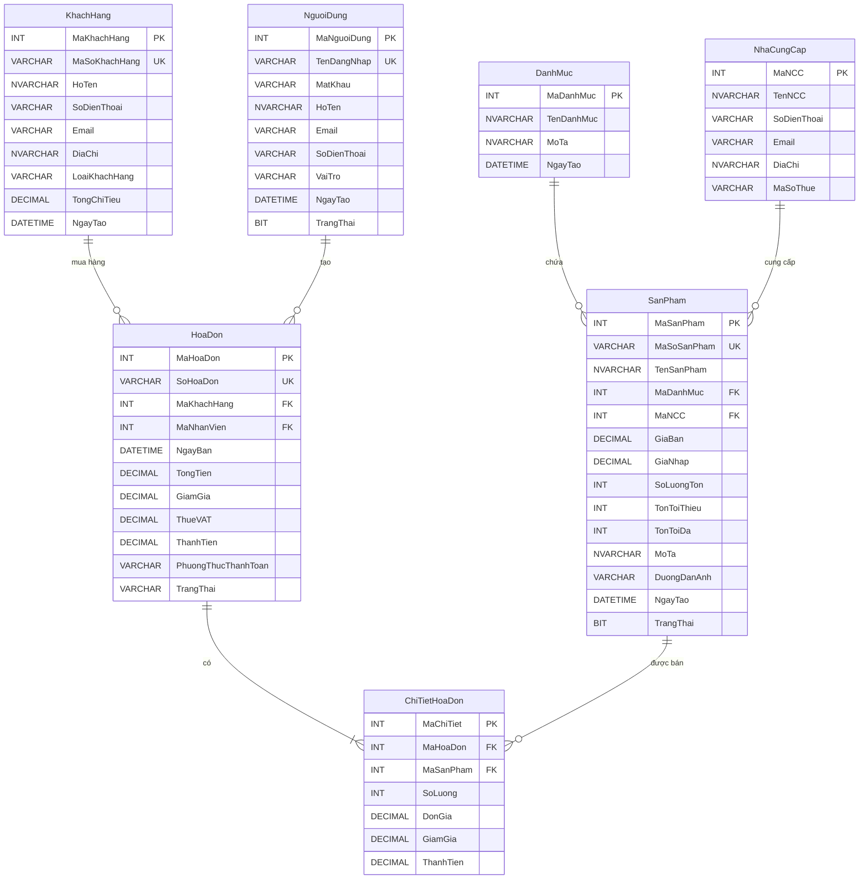

---

## 2. SƠ ĐỒ USE CASE

### 2.1 Use Case Tổng Quan Hệ Thống

```mermaid
flowchart TB
    subgraph Actors
        Admin[("👤 Quản trị viên")]
        Manager[("👤 Quản lý")]
        Staff[("👤 Nhân viên")]
        Customer[("👤 Khách hàng")]
    end
    
    subgraph "Hệ thống QL Cửa hàng Linh kiện"
        UC1[Đăng nhập/Đăng xuất]
        UC2[Quản lý người dùng]
        UC3[Quản lý sản phẩm]
        UC4[Quản lý danh mục]
        UC5[Quản lý nhà cung cấp]
        UC6[Quản lý khách hàng]
        UC7[Bán hàng POS]
        UC8[Quản lý hóa đơn]
        UC9[Nhập hàng]
        UC10[Báo cáo thống kê]
        UC11[Cảnh báo hàng tồn]
        UC12[Đổi mật khẩu]
    end
    
    Admin --> UC1
    Admin --> UC2
    Admin --> UC3
    Admin --> UC4
    Admin --> UC5
    Admin --> UC6
    Admin --> UC7
    Admin --> UC8
    Admin --> UC9
    Admin --> UC10
    Admin --> UC11
    Admin --> UC12
    
    Manager --> UC1
    Manager --> UC3
    Manager --> UC4
    Manager --> UC5
    Manager --> UC6
    Manager --> UC7
    Manager --> UC8
    Manager --> UC9
    Manager --> UC10
    Manager --> UC11
    Manager --> UC12
    
    Staff --> UC1
    Staff --> UC6
    Staff --> UC7
    Staff --> UC8
    Staff --> UC12
    
    Customer -.-> UC7
```

### 2.2 Use Case Chi Tiết - Quản Lý Sản Phẩm

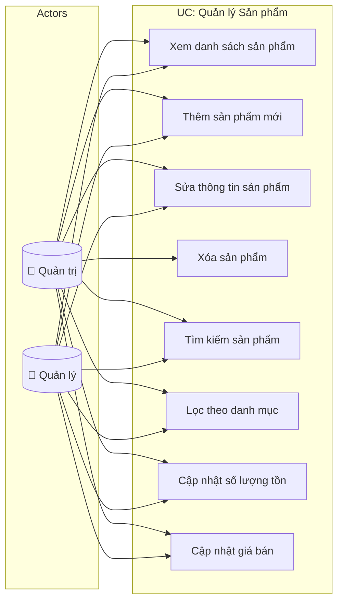

### 2.3 Use Case Chi Tiết - Bán Hàng (POS)

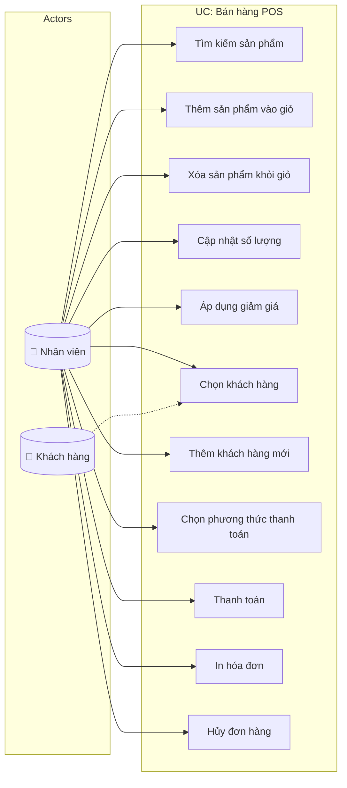

### 2.4 Use Case Chi Tiết - Báo Cáo Thống Kê

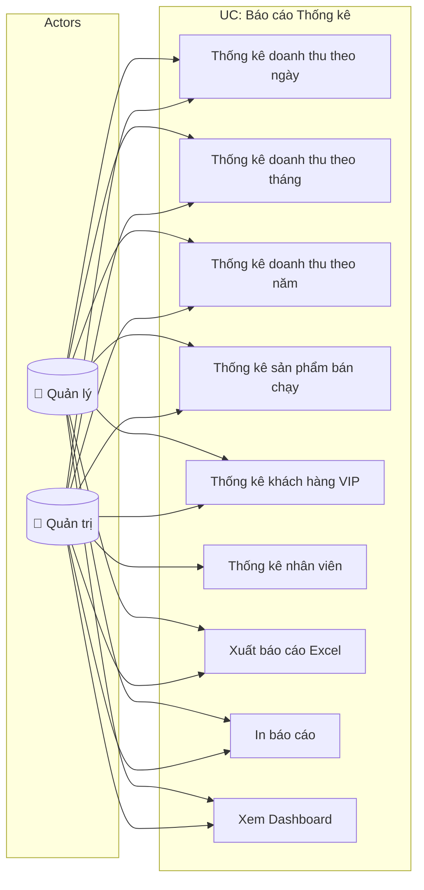

---

## 3. SƠ ĐỒ DFD (Data Flow Diagram)

### 3.1 DFD Level 0 - Context Diagram

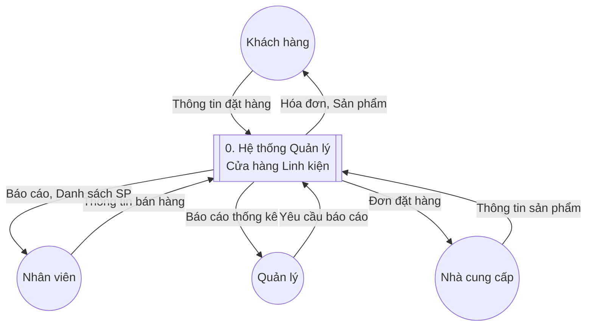

### 3.2 DFD Level 1

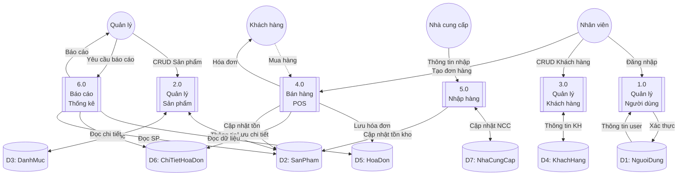

### 3.3 DFD Level 2 - Quy trình Bán hàng POS

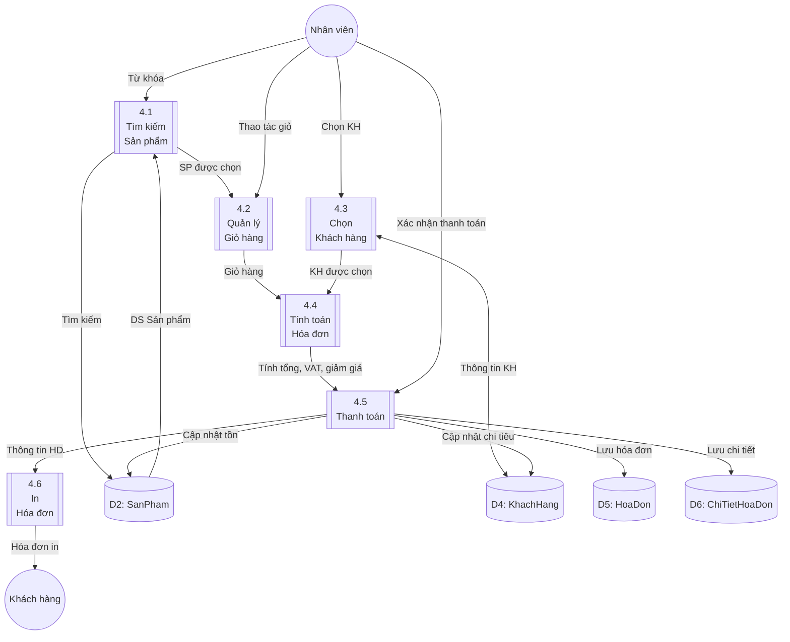

---

## 4. SƠ ĐỒ BFD (Business Flow Diagram)

### 4.1 Quy trình Bán hàng

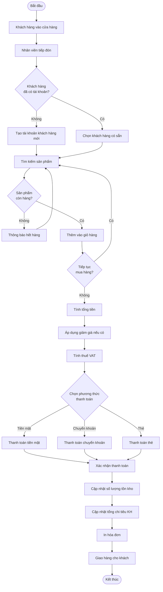

### 4.2 Quy trình Nhập hàng

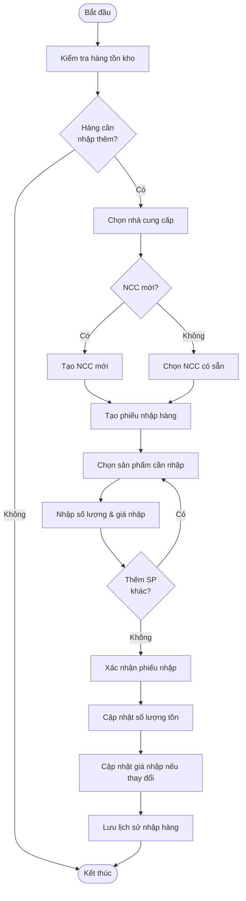

### 4.3 Quy trình Quản lý Sản phẩm

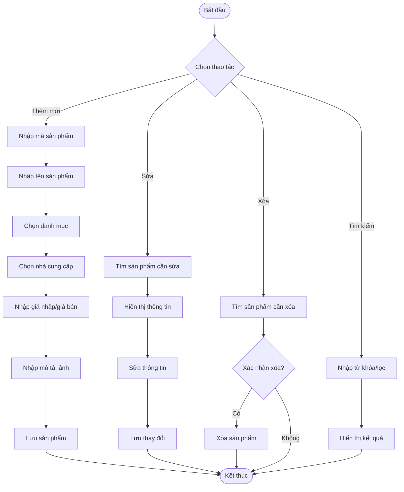

### 4.4 Quy trình Đăng nhập Hệ thống

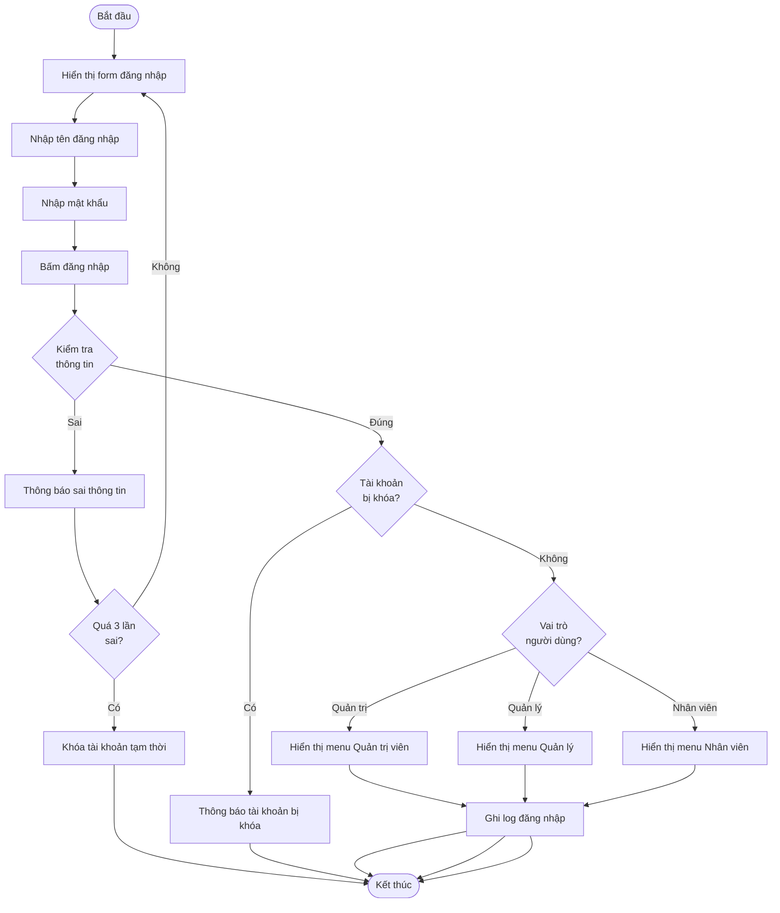

---

## 5. SƠ ĐỒ SEQUENCE

### 5.1 Sequence Diagram - Quy trình Bán hàng

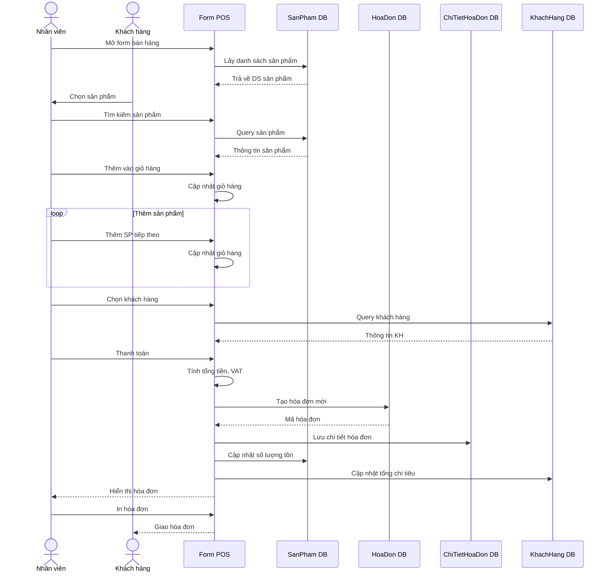

### 5.2 Sequence Diagram - Đăng nhập

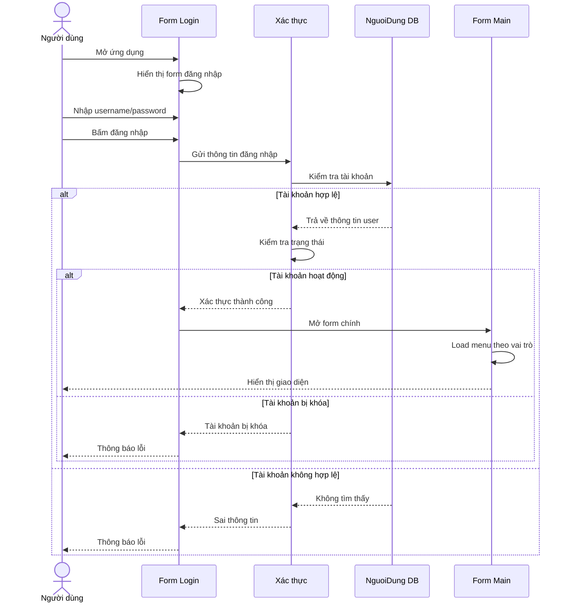

---

## 6. SƠ ĐỒ LỚP (CLASS DIAGRAM)

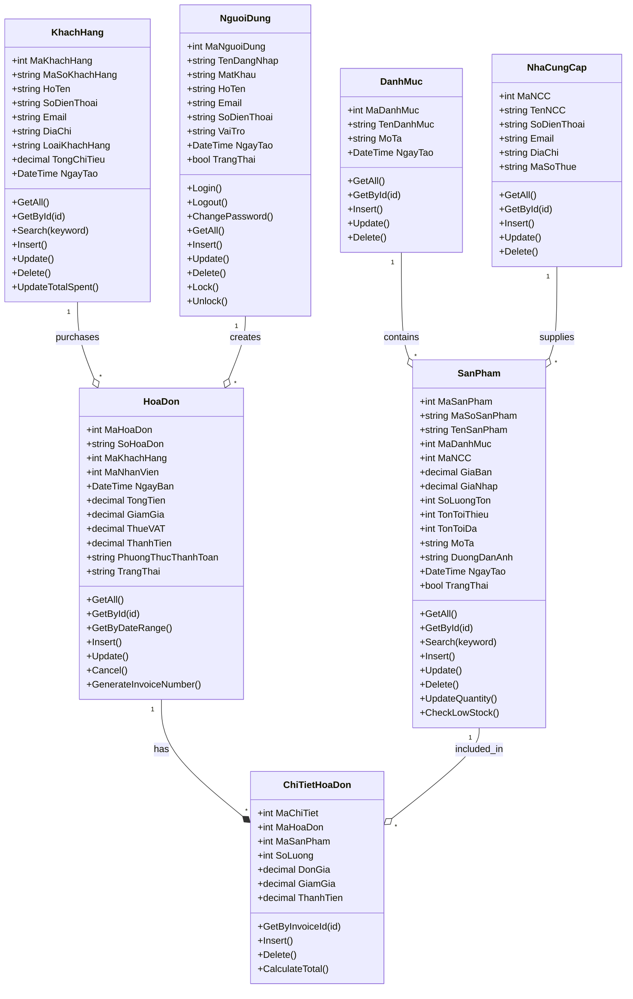

---

## 7. SƠ ĐỒ TRẠNG THÁI (STATE DIAGRAM)

### 7.1 Trạng thái Hóa đơn

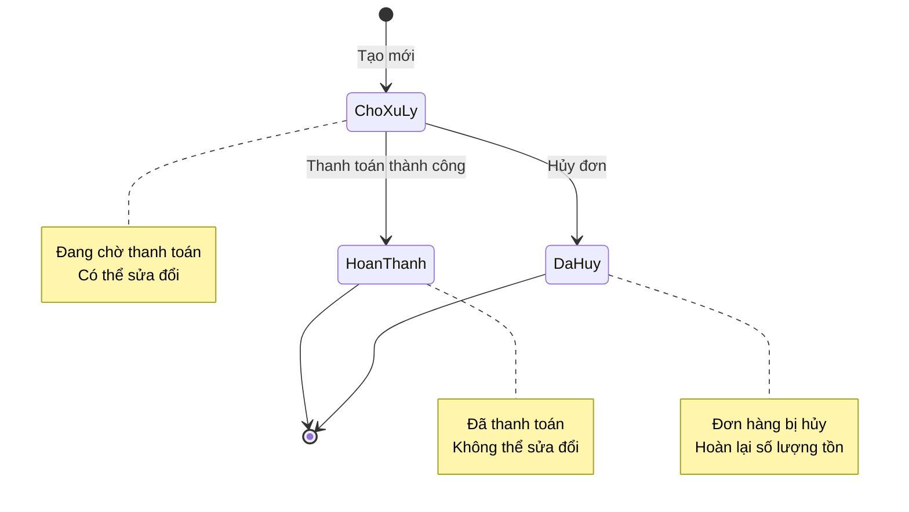

### 7.2 Trạng thái Tài khoản Người dùng

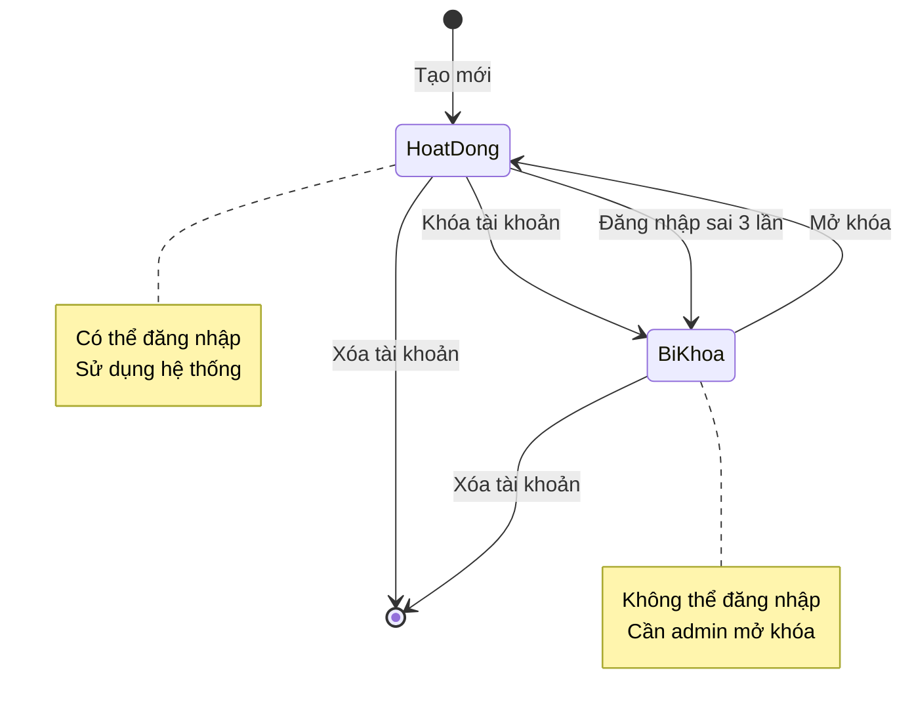

---

## 8. BẢNG PHÂN QUYỀN

| Chức năng | Quản trị | Quản lý | Nhân viên |
|-----------|:--------:|:-------:|:---------:|
| Đăng nhập/Đăng xuất | ✓ | ✓ | ✓ |
| Đổi mật khẩu | ✓ | ✓ | ✓ |
| Quản lý người dùng | ✓ | ✗ | ✗ |
| Quản lý danh mục | ✓ | ✓ | ✗ |
| Quản lý nhà cung cấp | ✓ | ✓ | ✗ |
| Quản lý sản phẩm | ✓ | ✓ | ✗ |
| Quản lý khách hàng | ✓ | ✓ | ✓ |
| Bán hàng (POS) | ✓ | ✓ | ✓ |
| Quản lý hóa đơn | ✓ | ✓ | ✓ |
| Nhập hàng | ✓ | ✓ | ✗ |
| Xem báo cáo | ✓ | ✓ | ✗ |
| Xuất báo cáo | ✓ | ✓ | ✗ |
| Cảnh báo hàng tồn | ✓ | ✓ | ✓ |
| Cấu hình hệ thống | ✓ | ✗ | ✗ |

---

## 9. GHI CHÚ

### Quy ước ký hiệu:
- **ERD**: Entity Relationship Diagram - Sơ đồ quan hệ thực thể
- **DFD**: Data Flow Diagram - Sơ đồ luồng dữ liệu
- **BFD**: Business Flow Diagram - Sơ đồ quy trình nghiệp vụ
- **Use Case**: Sơ đồ trường hợp sử dụng

### Công cụ vẽ:
- Các sơ đồ được vẽ bằng Mermaid syntax
- Có thể xem trực tiếp trên GitHub, VS Code (với extension Markdown Preview Mermaid)
- Hoặc copy vào https://mermaid.live để xem và export

### Ngày tạo: 31/01/2026
### Phiên bản: 1.0
